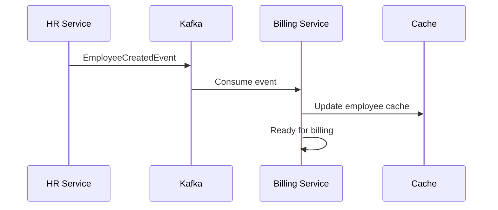

# 🏢 ACME Microservices Platform

[](https://openjdk.org/projects/jdk/21/)
[](https://spring.io/projects/spring-boot)
[](https://kafka.apache.org/)
[](https://docs.docker.com/compose/)

Enterprise-grade microservices platform featuring **Event-Driven Architecture**, **Service Discovery**, **API Gateway**, and **Distributed Caching**.

## 🏗️ Architecture Overview

```
┌─────────────────────────────────────────────────────────────┐
│                    API Gateway (8080)                      │
└─────────────────────┬───────────────────────────────────────┘
                      │
      ┌───────────────┼───────────────┐
      │               │               │
┌─────▼─────┐   ┌─────▼─────┐   ┌─────▼─────┐
│ Identity  │   │    HR     │   │  Billing  │
│ Service   │   │ Service   │   │ Service   │
└─────┬─────┘   └─────┬─────┘   └─────┬─────┘
      │               │               │
      └───────────────┼───────────────┘
                      │
              ┌───────▼───────┐
              │  Kafka Cluster │
              │  + Zookeeper   │
              └───────┬───────┘
                      │
              ┌───────▼───────┐
              │  Redis Cluster │
              │   (Cache)      │
              └───────────────┘
```

## 🚀 Key Features

### 🎯 **Event-Driven Architecture**
- **Apache Kafka** para messaging asíncrono
- **Typed Event Contracts** en commons library
- **Auto-topic creation** y management
- **Dead Letter Queues** para error handling

### 🔧 **Microservices Foundation**
- **Service Discovery** con Eureka
- **API Gateway** con load balancing y circuit breakers
- **Centralized Configuration** con Config Server
- **JWT Authentication** entre servicios

### 📊 **Observability & Monitoring**
- **Kafka UI** para debugging visual
- **Health checks** en todos los servicios
- **Actuator endpoints** para métricas
- **Structured logging**

### 🏭 **Enterprise Patterns**
- **Multi-module Maven** project
- **Shared libraries** (commons)
- **Docker Compose** para desarrollo
- **Professional project structure**

## 📂 Project Structure

```
acme-microservices/
├── 📦 commons/                    # Shared Libraries
│   ├── event-contracts/           # Typed event models
│   ├── kafka-client/             # Kafka abstractions
│   ├── cache-client/             # Redis utilities
│   └── common-security/          # JWT shared logic
├── 🏛️ platform/                   # Infrastructure Services
│   ├── api-gateway/              # Spring Cloud Gateway
│   ├── config-server/            # External configuration
│   ├── eureka-server/            # Service discovery
│   └── event-orchestrator/       # Kafka topic management
├── 🎯 services/                   # Business Services
│   ├── identity-svc/             # Authentication & users
│   ├── hr-svc/                   # Human resources
│   └── billing-svc/              # Invoice management
├── docker-compose.yml            # Complete infrastructure
└── pom.xml                       # Parent POM
```

## 🛠️ Technology Stack

| Component | Technology | Purpose |
|-----------|------------|---------|
| **Language** | Java 21 | Latest LTS with performance improvements |
| **Framework** | Spring Boot 3.4.5 | Microservices foundation |
| **Service Discovery** | Eureka | Service registry and discovery |
| **API Gateway** | Spring Cloud Gateway | Routing, load balancing, security |
| **Messaging** | Apache Kafka 3.6.0 | Event streaming platform |
| **Cache** | Redis | Distributed caching |
| **Database** | PostgreSQL 16 | Relational data storage |
| **Security** | JWT + Spring Security | Authentication & authorization |
| **Configuration** | Spring Cloud Config | Externalized configuration |
| **Containerization** | Docker + Docker Compose | Development environment |

## 🚀 Quick Start

### Prerequisites
- Java 21+
- Maven 3.9+
- Docker & Docker Compose
- Git

### 1. Clone & Build
```bash
git clone https://github.com/AlanFarias97/acme-microservices.git
cd acme-microservices

# Build all modules
mvn clean install -DskipTests
```

### 2. Start Infrastructure
```bash
# Start all services
docker-compose up -d

# Or start step by step
docker-compose up config-server eureka-server -d
docker-compose up kafka kafka-ui event-orchestrator -d
docker-compose up api-gateway -d
docker-compose up identity-svc hr-svc billing-svc -d
```

### 3. Verify Setup
```bash
# API Gateway
curl http://localhost:8080/actuator/health

# Kafka UI (Visual debugging)
open http://localhost:8090

# Eureka Dashboard
open http://localhost:8761

# Event Orchestrator
curl http://localhost:8084/actuator/health
```

## 🔗 Service Endpoints

| Service | Port | Health Check | Purpose |
|---------|------|--------------|---------|
| **API Gateway** | 8080 | `/actuator/health` | Main entry point |
| **Eureka Server** | 8761 | `/actuator/health` | Service registry |
| **Config Server** | 8888 | `/actuator/health` | Configuration |
| **Event Orchestrator** | 8084 | `/actuator/health` | Kafka management |
| **Identity Service** | Internal | Via Gateway `/identity/*` | Authentication |
| **HR Service** | 8083 | Via Gateway `/hr/*` | Employee management |
| **Billing Service** | 8082 | Via Gateway `/billing/*` | Invoice management |
| **Kafka UI** | 8090 | Web Interface | Kafka debugging |

## 🎭 Event Flow Example

### Employee Creation Flow


### Available Events
- `hr.employee.created` - New employee
- `hr.employee.updated` - Employee changes
- `hr.employee.deleted` - Employee removal
- `billing.invoice.created` - New invoice
- `billing.invoice.paid` - Payment received

## 🧪 Testing

### Unit Tests
```bash
mvn test
```

### Integration Tests
```bash
mvn verify
```

### Manual Testing
```bash
# Get JWT token
curl -X POST http://localhost:8080/identity/auth/login \
  -H "Content-Type: application/json" \
  -d '{"username":"demo","password":"demo"}'

# Use token for authenticated calls
curl -H "Authorization: Bearer <TOKEN>" \
  http://localhost:8080/hr/employees
```

## 🔧 Development

### Adding New Events
1. Define event in `commons/event-contracts`
2. Add topic in `event-orchestrator/KafkaTopicConfiguration`
3. Implement producer in source service
4. Implement consumer in target service

### Adding New Service
1. Create module in `services/`
2. Add dependency on commons modules
3. Configure Eureka client
4. Add routes in API Gateway
5. Update docker-compose.yml

## 🌟 Roadmap

- [ ] **Cache Implementation** - Redis multi-level caching
- [ ] **Distributed Tracing** - Sleuth + Zipkin
- [ ] **Metrics & Monitoring** - Prometheus + Grafana  
- [ ] **Event Sourcing** - Complete audit trail
- [ ] **SAGA Pattern** - Distributed transactions
- [ ] **API Documentation** - OpenAPI/Swagger
- [ ] **CI/CD Pipeline** - GitHub Actions
- [ ] **Kubernetes Deployment** - Helm charts

## 📚 Documentation

- [Event Contracts Guide](docs/events.md)
- [Service Communication](docs/communication.md)
- [Security Setup](docs/security.md)
- [Kafka Configuration](docs/kafka.md)
- [Docker Deployment](docs/deployment.md)

## 🤝 Contributing

1. Fork the repository
2. Create feature branch (`git checkout -b feature/amazing-feature`)
3. Commit changes (`git commit -m 'Add amazing feature'`)
4. Push to branch (`git push origin feature/amazing-feature`)
5. Open a Pull Request

## 📄 License

This project is licensed under the MIT License - see the [LICENSE](LICENSE) file for details.

## 👨‍💻 Author

**Alan Farias**
- GitHub: [@AlanFarias97](https://github.com/AlanFarias97)
- LinkedIn: [Alan Farias](https://linkedin.com/in/alanfarias97)

---

⭐ **Star this repo if you find it useful!**